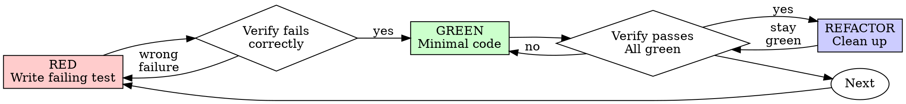

# Test-Driven Development (TDD)

## Overview

Write the test first. Watch it fail. Write minimal code to pass.

**Core principle:** If you didn't watch the test fail, you don't know if it tests the right thing.

## When to Use

**Use TDD for:**
- New features with meaningful logic
- Bug fixes (regression test proves the fix)
- Refactoring with behavior changes
- Any work where test-first would catch design problems early

**TDD is optional for:**
- Trivial mechanical changes (renames, config, formatting)
- Generated code
- Throwaway prototypes

When in doubt, write the test first — it's faster than debugging later.

## Red-Green-Refactor



### RED - Write Failing Test

Write one minimal test showing what should happen.

<Good>
```typescript
test('retries failed operations 3 times', async () => {
  let attempts = 0;
  const operation = () => {
    attempts++;
    if (attempts < 3) throw new Error('fail');
    return 'success';
  };

  const result = await retryOperation(operation);

  expect(result).toBe('success');
  expect(attempts).toBe(3);
});
```
Clear name, tests real behavior, one thing
</Good>

<Bad>
```typescript
test('retry works', async () => {
  const mock = jest.fn()
    .mockRejectedValueOnce(new Error())
    .mockRejectedValueOnce(new Error())
    .mockResolvedValueOnce('success');
  await retryOperation(mock);
  expect(mock).toHaveBeenCalledTimes(3);
});
```
Vague name, tests mock not code
</Bad>

**Requirements:**
- One behavior
- Clear name
- Real code (no mocks unless unavoidable)

### Verify RED - Watch It Fail

Run the affected test. Confirm it fails because the feature is missing, not because of typos or syntax errors.

### GREEN - Minimal Code

Write simplest code to pass the test. Don't add features, refactor other code, or "improve" beyond the test.

### Verify GREEN - Watch It Pass

Run the affected test. Confirm it passes. Run broader verification at logical completion boundaries, not after every small iteration.

### REFACTOR - Clean Up

After green only: remove duplication, improve names, extract helpers. Keep tests green. Don't add behavior.

## Good Tests

| Quality | Good | Bad |
|---------|------|-----|
| **Minimal** | One thing. "and" in name? Split it. | `test('validates email and domain and whitespace')` |
| **Clear** | Name describes behavior | `test('test1')` |
| **Shows intent** | Demonstrates desired API | Obscures what code should do |

For nontrivial test design, mocking decisions, or when existing tests are poor, consult [writing-good-tests.md](writing-good-tests.md). For straightforward tests following existing patterns, proceed directly.

## Common Rationalizations

| Excuse | Reality |
|--------|---------|
| "Too simple to test" | Simple code breaks. Test takes 30 seconds. |
| "I'll test after" | Tests written after pass immediately — you never proved they can catch the bug. |
| "Need to explore first" | Fine. Throw away exploration, start with TDD. |
| "Test hard = skip test" | Hard to test = hard to use. Simplify the interface. |
| "TDD will slow me down" | TDD catches bugs before commit, prevents regressions. Debugging in production is slower. |

## Example: Bug Fix

**Bug:** Empty email accepted

**RED**
```typescript
test('rejects empty email', async () => {
  const result = await submitForm({ email: '' });
  expect(result.error).toBe('Email required');
});
```

**Verify RED** — fails with "expected 'Email required', got undefined"

**GREEN**
```typescript
function submitForm(data: FormData) {
  if (!data.email?.trim()) {
    return { error: 'Email required' };
  }
  // ...
}
```

**Verify GREEN** — passes

**REFACTOR** — Extract validation for multiple fields if needed.

## When Stuck

| Problem | Solution |
|---------|----------|
| Don't know how to test | Write wished-for API. Write assertion first. Ask your human partner. |
| Test too complicated | Design too complicated. Simplify interface. |
| Must mock everything | Code too coupled. Use dependency injection. |
| Test setup huge | Extract helpers. Still complex? Simplify design. |

## Debugging Integration

Bug found? Write failing test reproducing it. Follow TDD cycle. Test proves fix and prevents regression.
